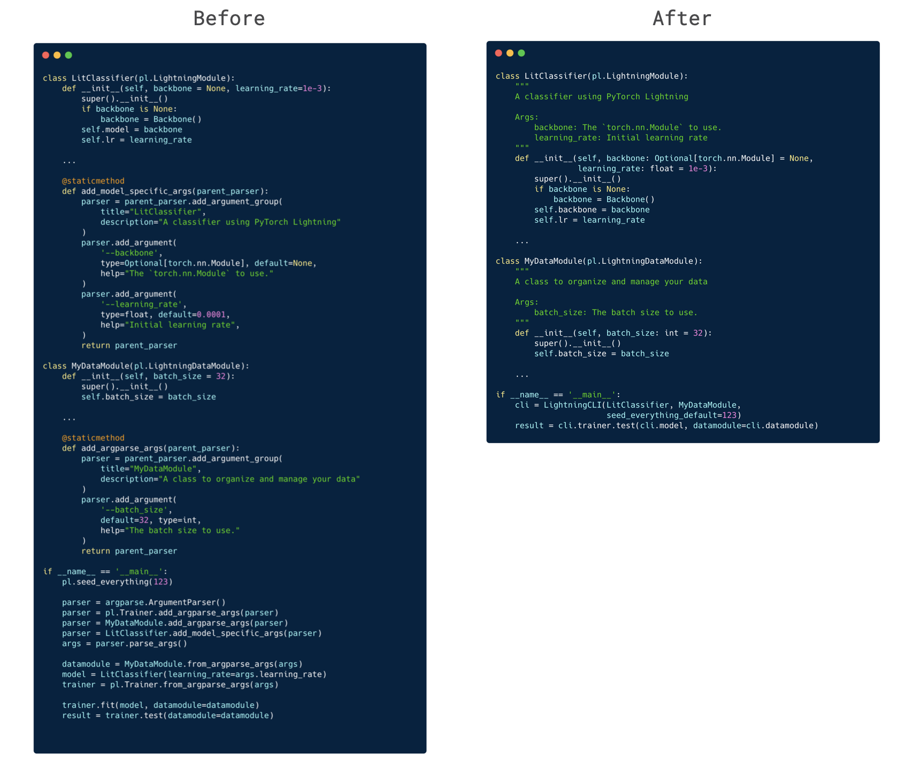

# Pytorch-ONNX-Tensorflow
### Reference

---

[PyTorch를 ONNX로 export하기](https://yunmorning.tistory.com/17)

[torch.onnx - PyTorch 1.10.0 documentation](https://pytorch.org/docs/master/onnx.html)

## ONNX란?

---


ONNX란 Open Neural Network Exchage의 약자로, Tensorflow, PyTorch 등 서로 다른 딥러닝 프레임워크 환경에서 만들어진 모델끼리 상호 호환이 가능하도록 만들어진 플랫폼이다.

이제 PyTorch가 주류 딥러닝 연구 프레임으로 자리잡았으나, 아직 산업계에서는 Tensorflow의 활용도가 훨씬 높은 것같다. 특히 모델 서빙&관리적 측면에서 여러 많은 유용한 라이브러리가 많은 반면 PyTorch는 아직 부족한 것같다. 아마 구글의 엔지니어들도 모델 서빙&관리에 대해 많은 고민을 했기 때문일 것...

Tensorflow Serving은 텐서플로 모델을 기반으로 API 서버까지 똵 만들어준다! Tensorflow Extended(TFX)의 경우 ML 파이프라인을 배포할 때 유용한 End-to-End 플랫폼이다! 이 외에도 많다고는 하던데 일단 내가 하는 한도 내에서는 이거까지!

암튼 간단히 말하자면 ONNX를 활용하면 PyTorch 기반 모델을 Tensorflow 모델로 바꿀 수 있다! 심지어 C++로 모델을 서빙할 수도 있다고는 하는데,, 여기까지는 아직 도전하지 않는 거로~

이건 뭐 부차적이긴 하지만, 아래 사이트를 통해 ONNX의 그래프를 쉽게 Visualization 할 수도 있다!

[Netron](https://netron.app/)


## PyTorch Lightning

---


PyTorch Lightning은 PyTorch에 대해 High Level 인터페이스를 제공하는 라이브러리이다. 물론 PyTorch 만으로도 충분히 간편하게 딥러닝 모델을 구축할 수 있으나, 이를 보다 쉽게 더욱 간편하게 해주는 라이브러리이다!



아직도 안쓰시나요? 저런,,,

아니나 다를까,, PyTorch 모델을 ONNX로 변환하는 것도 PyTorch Lightning을 활용해 조금 더 쉽게 할 수 있다!! 아아.. PyTorch Lightning은 그저 빛...

PyTorch Lightning 만든 사람,, 대통령상 정도는 받아야하지 않나?
- 기대현(1993~ )

아무튼 본 예제에서 사용할 모델이랑 학습 모듈 구조는 다음과 같다.

**model.py**

```python
import torch.nn as nn
import torch.nn.functional as F

class SimpleCNN(nn.Module):
    def __init__(self):
        super(SimpleCNN, self).__init__()
        self.conv1 = nn.Conv2d(1, 32, (5, 5), (2, 2))
        self.conv2 = nn.Conv2d(32, 64, (5, 5), (2, 2))

        self.max_pool = nn.MaxPool2d(1)
        self.flatten = nn.Flatten()
        self.relu = nn.ReLU()

        self.fc = nn.Sequential(
            nn.Linear(1024, 512),
						nn.ReLU()
            nn.Dropout(),
            nn.Linear(512, 10)
        )

    def forward(self, x):
        x = self.conv1(x)
        x = self.max_pool(x)
        x = self.conv2(x)
        x = self.max_pool(x)
        x = self.flatten(x)
        x = self.relu(x)
        y_hat = F.log_softmax(self.fc(x), dim=-1)
        return y_hat
```

**trainmodule.py**

```python
import torch.nn as nn
import torch.optim as optim
import pytorch_lightning as pl
from model import SimpleCNN

class TrainModule(pl.LightningModule):
    def __init__(self):
        super(TrainModule, self).__init__()
        self.model = SimpleCNN()
        self.loss_fn = nn.NLLLoss()

    def configure_optimizers(self):
        optimizer = optim.AdamW(lr=1e-3, params=self.model.parameters())
        return optimizer

    def forward(self, x):
        return self.model(x)

    def training_step(self, batch, batch_idx):
        x, y = batch
        y_hat = self.model(x)
        loss = self.loss_fn(y_hat, y)
        self.log('train_loss', loss)
        self.log('train_loss_epoch', loss, on_step=False, on_epoch=True)
        return {'loss': loss}

    def validation_step(self, batch, batch_idx):
        x, y = batch
        y_hat = self.model(x)
        loss = self.loss_fn(y_hat, y)
        self.log('val_loss', loss, on_step=False, on_epoch=True)
```

## PyTorch2ONNX

---

캬아 PyTorch(Lightning) → ONNX은 정말정말 쉽다!

**PyTorch2ONNX.py**

```python
import torch.onnx

from trainmodule import TrainModule

model_path = './CKPT/MNIST.ckpt'
batch_size = 1

model = TrainModule().load_from_checkpoint(model_path)
x = torch.randn((batch_size, 1, 28, 28), requires_grad=True)

model.to_onnx(file_path='./data/MNIST.onnx',
              input_sample=x,
              input_names=['input'],
              output_names=['output'],
              export_params=True)
```

- TrainModule은 PyTorch Lightning의 LightningModule을 상속했었는데, 여기에는 to_onnx라는 메서드가 존재한다. 그거 하나 실행시켜주면 된다!
- 약간 특이한 점은 변환할 때 sample input값을 알려줘야 한다는 점이다.
    - 적절한 자료형과 모양만 갖추고 있다면, 내부 값은 랜덤하게 결정되어도 무방하다
    - 특정 차원들 동적으로 지정하지 않는 이상, ONNX로 변환된 그래프의 입력 사이즈는 고정된다.

?? : 엥? 그럼 그냥 PyTorch는 입력 사이즈가 고정되지 않아도 되나요?
나 : 그러던디?

- 특정 차원을 가변으로 해주려면 이케 인자를 넣어주면 된다.

```python
# 대충 input의 0번째 차원은 배치 사이즈 차원이고
# 동적이라 변경되어도 상관없다는 뜻
dynamic_axes={'input' : {0 : 'batch_size'}}
```

### ONNX의 한계

---

- PyTorch의 JIT compiler가 아직 완벽하지 않아 파이썬으로 구현한 모델에 대해 완벽히 support하는 것은 아니다...
- PyTorch와 ONNX의 backend 구현에 차이가 분명히 존재하기 때문에, 모델 구조에 따라 다르지만 모델 성능이 저하될 여지가 존재한다.
- 그.래.서.

**onnxtest.py**
```python
import torch
from trainmodule import TrainModule
import numpy as np

import onnxruntime

def to_numpy(tensor):
    return tensor.detach().cpu().numpy() if tensor.requires_grad else tensor.cpu().numpy()

test_input = torch.randn((1, 28, 28))
model = TrainModule().load_from_checkpoint('./CKPT/MNIST.ckpt')
model.eval()

torch_output = model(test_input[None])
# torch_output = torch.randn((1, 10))

ort_session = onnxruntime.InferenceSession('./data/MNIST.onnx')
ort_session.get_providers()

input_name = ort_session.get_inputs()[0].name

ort_inputs = {ort_session.get_inputs()[0].name: to_numpy(test_input)[None]}
ort_outputs = ort_session.run(None, ort_inputs)

try:
    result = np.testing.assert_allclose(to_numpy(torch_output), ort_outputs[0], rtol=1e-3, atol=1e-5)
except AssertionError as e:
    print(e)
		print("ONNX 변환을 멈추고 API 서버 개발에 힘쓰는 게 정신건강에 이롭습니다.")

if result is None:
    print("우히히힣 잘됐다아앙")
    print(np.sum(to_numpy(torch_output) - ort_outputs[0]))
```

- PyTorch 모델과 ONNX로 변환한 모델의 성능차를 항상 비교해줘야 한다.
- 다행히 이번 예제에서는 큰 성능차가 없었다.
- 로그
    
    ```python
    우히히힣 잘됐다아앙
    1.001358e-05
    ```
    

## ONNX-Tensorflow 설치

---

**onnx-tensorflow.sh**

```python
git clone https://github.com/onnx/onnx-tensorflow.git

cd onnx-tensorflow

pip install -e .
```

- [onnx-tensorflow.sh](http://onnx-tensorflow.sh) 셸스크립트를 실행해 onnx-tensorflow를 설치해주자
    - tensorflow는 이런 것조차 불편하다 걍 pip로 설치하면 좀 좋나?
    - 아니 애초에 tensorflow에 묶어주면 되잖아?
    - 흥!

## ONNX2tf

---

ONNX**2tf.py**

```python
from onnx_tf.backend import prepare
import onnx

TF_PATH = "./data/MNIST.pb"
ONNX_PATH = './data/MNIST.onnx'
onnx_model = onnx.load_model(ONNX_PATH)

tf_rep = prepare(onnx_model)

tf_rep.export_graph(TF_PATH)
```

- 설치는 약간 불편했을 수도 있었으나, ONNX → Tensorflow 자체는 뭐,, 크게 어려울 게 없다.